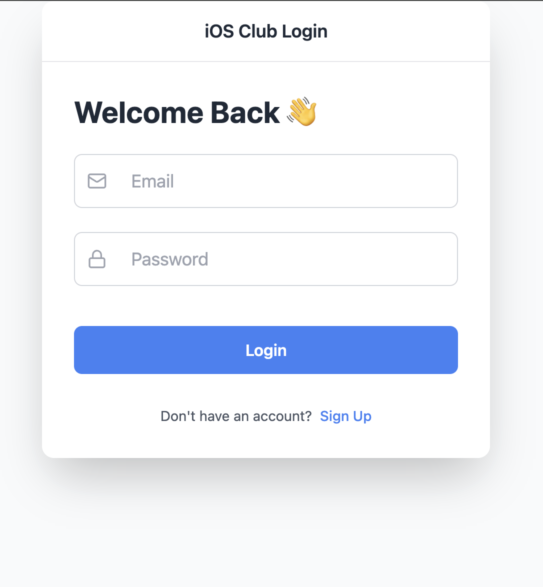
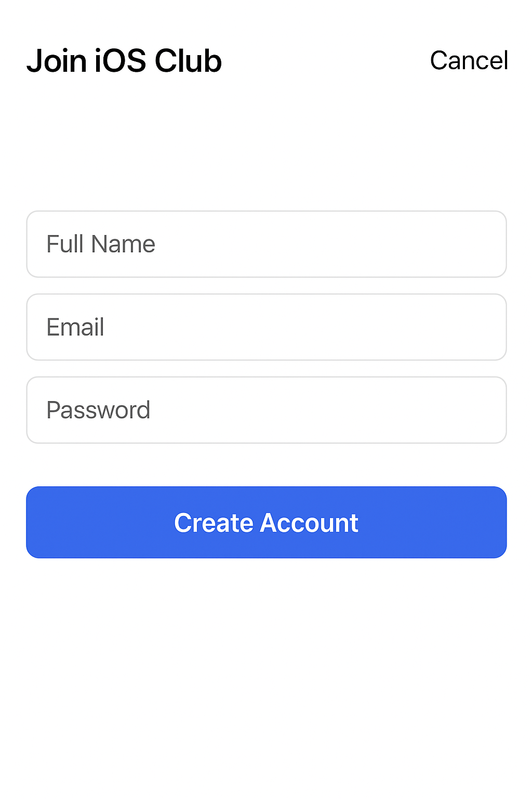

# flutter_application_1

A new Flutter project.

## Getting Started

This project is a starting point for a Flutter application.

## Run Command 

flutter pub get

flutter run

## Output UI
Login Page : 

Signup Page :

